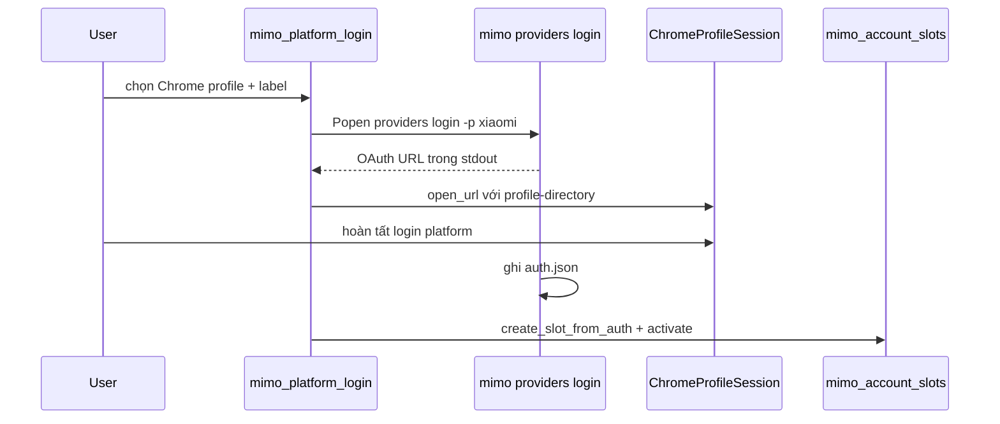

# MiNo VIP + MiMo CLI — hướng dẫn nội bộ cho Agent

> **Trạng thái:** `INTERNAL — CHƯA PHÁT HÀNH CHO NGƯỜI DÙNG`  
> **Cập nhật:** 2026-07-05  
> **Đọc file này** trước khi sửa reset MiMo, slot accounts, menu MiMo login, hoặc tích hợp MiMo CLI.
>
> **Cursor workbench:** vẫn đọc thêm [AGENT-WORKBENCH-PATCH-SAFETY.md](./AGENT-WORKBENCH-PATCH-SAFETY.md) trước khi patch Cursor IDE.

---

## 1. Repo là gì? (2 hệ thống)

| Hệ thống | Entry | Mục đích |
|----------|-------|----------|
| **MiNo VIP** | `start.bat` → `main.py` | Python CLI: Cursor reset, MiMo login/slots, reset MiMo |
| **MiMo CLI** | `mimo/start.bat` | Terminal AI (`@mimo-ai/cli` / MiMoCode) |

Hai phần **độc lập** nhưng cùng repo `D:\CURORVIP\mino-vip`. Rebrand từ *Cursor Free VIP* → *MiNo VIP* (config `.mino-vip`, env `MINO_VIP_*`).

**Đã gỡ:** menu đăng ký Cursor 1–5 và modules `cursor_register*`, `github_cursor_register`, `new_tempemail`. **Giữ** `new_signup.py` (path helper cho reset Cursor).

---

## 2. Menu MiNo VIP (0–7)

| # | Mục | Module |
|---|-----|--------|
| 0 | Thoát | — |
| 1 | Thay đổi ngôn ngữ | `main.select_language` |
| 2 | Reset hoàn toàn Cursor | `totally_reset_cursor` |
| 3 | Chọn Chrome profile | `chrome_profile.select_chrome_profile` |
| 4 | Reset ID MiMo | `reset_mimo_machine` |
| 5 | Reset hoàn toàn MiMo | `totally_reset_mimo` |
| 6 | **Đăng nhập MiMo Platform** | `mimo_platform_login` / `mimo/login_platform.bat` |
| 7 | **Quản lý account MiMo** | `mimo_manage_accounts` / `mimo/manage_accounts.bat` |

### Tra nhanh — lệnh

| Cần làm | Lệnh / menu |
|---------|-------------|
| Menu chính | `start.bat` |
| Reset ID MiMo (nhẹ) | Menu **4** / `python reset_mimo_machine.py` |
| Reset toàn bộ MiMo | Menu **5** / `python totally_reset_mimo.py` |
| Login MiMo Pro | Menu **6** / `mimo/login_platform.bat` |
| Quản lý slots | Menu **7** / `mimo/manage_accounts.bat` |
| MiMo Auto sau reset | `python setup_mimo_auto.py` |
| E2E | `python scripts/e2e_smoke_test.py --json` |
| Phase loop | `python scripts/phase_loop.py --json` |

**Env:** `MINO_VIP_LANG`, `MINO_VIP_KEEP_RUNNING`, `MINO_VIP_QUIET`, `MINO_VIP_LIVE_OAUTH=1` (chỉ E2E OAuth live, không CI).

---

## 3. MiMo Platform OAuth (Phase 0 spike)

**Lệnh spike:**

```powershell
cd D:\CURORVIP\mino-vip\mimo
node_modules\.bin\mimo.cmd providers login -p xiaomi --print-logs --log-level INFO
```

**Kết quả đã verify (2026-07-05):**

| Mục | Giá trị |
|-----|---------|
| URL pattern | `https://platform.xiaomimimo.com/authorize?pk=...&redirect_uri=...&kn=mimocode&key_name=...` |
| Regex Python | `r"https://platform\.xiaomimimo\.com/authorize\?[^\s\|]+"` |
| Dòng log | `Browser didn't open? Use the url below to sign in:` rồi URL trên dòng `\|` |
| Timeout khuyến nghị | **120s** (poll `auth.json` + process) |
| Exit code | 0 khi callback `127.0.0.1` thành công và CLI ghi `auth.json` |
| `auth.json` block | `xiaomi.type = "api"`, `xiaomi.key`, `metadata.uid` (sau login) |

**Fallback:** Menu 6 → option 2 paste API key → `mimo_auth.write_xiaomi_auth()` → lưu slot.

**Blocker Phase 0:** Không có — URL parse ổn định bằng regex trên. Nếu CLI đổi format log → dùng fallback API key.

---

## 4. Multi-account slots (dynamic)

**Thư mục:** `%USERPROFILE%\.local\share\mimocode\accounts\`

| File | Vai trò |
|------|---------|
| `manifest.json` | `active_slot_id`, danh sách slot |
| `slot_<id>.json` | Full snapshot `auth.json` (giữ github-copilot/openai nếu có) |

**Schema `manifest.json`:**

```json
{
  "version": 1,
  "active_slot_id": "slot-a1b2c3",
  "slots": [
    {
      "id": "slot-a1b2c3",
      "label": "gmail01@gmail.com",
      "chrome_profile": "Profile 5",
      "chrome_display_name": "Work 1",
      "xiaomi_uid": "6877712299",
      "saved_at": "2026-07-05T06:00:00Z",
      "file": "slot_a1b2c3.json"
    }
  ]
}
```

**API:** `mimo_account_slots.py` — `list_slots`, `list_slot_entries`, `create_slot_from_auth`, `activate_slot`, `delete_slot`, `rename_slot`, `backup_active_auth_to_slot`, `extract_xiaomi_meta` (mask key, không log full key).

**Activate** = copy snapshot → `auth.json` + set `active_slot_id`.

---

## 5. MiMo login flow (menu 6)



**Module map:**

| File | Vai trò |
|------|---------|
| `chrome_profile.py` | Profile list, `ChromeProfileSession.open_url` |
| `mimo_platform_login.py` | Subprocess CLI, regex URL, poll auth |
| `mimo_manage_accounts.py` | UI menu 7 |
| `mimo_paths.py` | `get_mimo_accounts_dir`, `get_mimo_protected_dirs` |

---

## 6. Reset vs accounts/ protection (menu 4/5)

### Menu 4 — `reset_mimo_machine.py`

Trước `os.remove(auth.json)` khi có block `xiaomi`:

1. `backup_active_auth_to_slot(label="auto-backup-before-reset-<timestamp>")`
2. In cảnh báo: slots Pro vẫn trong `accounts/`; MiMo Auto cần Tab sau reset

### Menu 5 — `totally_reset_mimo.py`

- **Không** xóa `accounts/` (`get_mimo_protected_dirs()` = `["accounts"]`)
- Backup auth vào slot trước wipe (giống menu 4)
- Xóa DB, memory, snapshot, … như cũ

---

## 7. MiMo identity & Auto (tóm tắt)

Data: `%USERPROFILE%\.local\share\mimocode\`

| File | Vai trò |
|------|---------|
| `installation_id` | UUID cài đặt |
| `mimo-free-client` | telemetry machineId |
| `mimo-key-name` | anonymous channel key name |
| `auth.json` | API key OAuth (Pro) — active slot |

Bootstrap MiMo Auto: `POST https://api.xiaomimimo.com/api/free-ai/bootstrap` với `{"client": "<mimo-free-client>"}`.

**Quy tắc `mimocode.jsonc`:** không thêm partial `provider.mimo` — xem `setup_mimo_auto.py`.

---

## 8. Test gate

```powershell
cd D:\CURORVIP\mino-vip
python scripts/e2e_smoke_test.py --json    # expect 9/9
python scripts/phase_loop.py --json        # expect 12/12
```

E2E gồm: slot CRUD (temp dir), `accounts/` protected, module imports. **Không** live OAuth trong CI.

---

## 9. Manual gate — onboard N Gmail (Phase 7)

Loop thủ công (không auto batch):

1. [ ] Chrome profile N đã login Gmail + MiMo Platform (balance/Token Plan OK)
2. [ ] Menu **6** → login → slot created
3. [ ] Menu **7** → verify list (uid, label, profile, key prefix)
4. [ ] `mimo/start.bat` → model Pro → test chat
5. [ ] Lặp N = 1..30 (hoặc bao nhiêu account cần)

**Release gate (tối thiểu):**

- [ ] ≥3 slot login OK
- [ ] Activate / switch giữa slot OK (menu 7)
- [ ] Menu **4** và **5** không mất `accounts/`; có auto-backup slot khi reset với auth Pro

**Optional:** `Documents\.mino-vip\mimo_profile_hints.json` map `Profile 5 → gmail01@...` (label hint only).

---

## 10. Phân biệt Cursor vs MiMo

| | Cursor (menu 2) | MiMo (menu 4, 5) |
|---|----------------|------------------|
| Target | `%APPDATA%\Cursor\` | `~/.local/share/mimocode/` |
| Pro accounts | — | `accounts/` + menu 6/7 |

---

## 11. Checklist agent mới

1. Đọc file này + `AGENT-WORKBENCH-PATCH-SAFETY.md`
2. `python scripts/e2e_smoke_test.py --json` — baseline pass
3. Menu 4/5 ≠ Cursor totally reset (menu 2)
4. Không xóa `accounts/` trong total reset
5. Mọi thay đổi slot/login → chạy lại E2E

---

*Tài liệu nội bộ — cập nhật khi OAuth/slot/reset MiMo thay đổi.*
